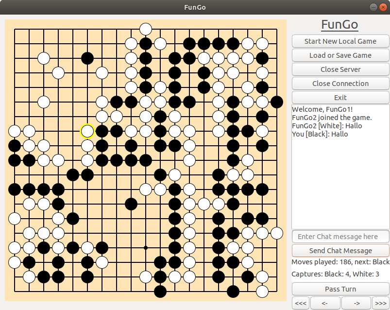

# FunGo

## Overview
This project implemtents the game **Go** with **Haskell**, **GTK** and **Glade**. 
You can load and save games as **".sgf"-files**.
Revisit already played moves by going through a list of all moves.
Play online with a friend by creating and connecting to a server. 
To play together you may need to set up Hamachi or NoIp.

## Installation
- Set up stack for Haskell: https://docs.haskellstack.org/en/stable/README/
- Install the following packages: `sudo apt-get install libgtk2.0-dev libpango1.0-dev libglib2.0-dev libcairo2-dev build-essential libgtk-3-dev`
- `git clone` the project (or download)
- `cd ffp/`
- `stack build`
- `stack exec FunGo`

## Further Information
This project was initially created for final examation in "Advanced Functional Programming".

The project was made in stack and we encourage everyone using it to simply use stack
and compile it with `stack build` and run it with `stack exec FunGo`.

It was tested on **Arch**, **Ubuntu 18.04** and **Ubuntu 20.04.**
We do not provide any Windows support, but feel free to email us if you need help on linux.
We provided a compiled version that should work on all up to date linux version (13.9.2020).

FunGo provides: 
  - local games
  - multiplayer
  - chatting with your opponent
  - loading and saving your game (including continuing multiplayergames)
  - the ability to check old game states in your current game
  
Most of the time simply following the instructions when clicking a button is enough.

- To play a local game you can simply start FunGo and start playing.
- To start a new game click "Start New Game".
- To Load/Save click the "Load or Save" Button and follow the instructions.
- To open a multiplayer server click the button and enter a valid port that is open for both players, a name for you and choose the color you want to play.
- To connect click the button and enter the IP of your opponent with the port (Example: 192.168.0.2:3000).
  (To get your IP check google etc.)
- You may chat when in multiplayer.
- To leave/close a coonection/server click the close server/connection buttons.
- You may save a game after closing the server/connection.
- If you want to continue playing a game either load or play till you want your opponent to start and start a server.
  The game will be transfered to your opponent and you can play.
- To view an old game state use the back and forward buttons at the bottom (<<<, <-, ->, >>>).
- When the game has ended or you want it to end, 
use your interpretation of the rules as well as the provided information of captures to calculate the winner/loser.
